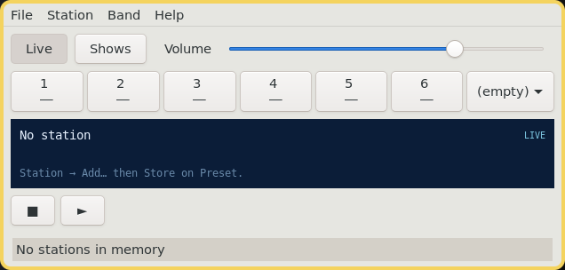

# Listen-O-Matic

**Vended by Grok Build**



A **kitchen radio** for The Lunduke Computer Operating System (LCOS). Live streams and podcast shows on one face: six presets per band, a Memory list, a now-playing well.

Binary: `listenomatic`. Unlicense.

LCOS itself: [https://github.com/BryanLunduke/LCOS](https://github.com/BryanLunduke/LCOS)

## Status

**v1.0.17.** A pending episode seek does not jump a Live stream. Live, Shows, Catalog, last program, saved window size, 15-minute feed refresh. The seek grip stays off +15 under Clearlooks. Headless test suite and BUG-BACKLOG.md. The `.deb` is the install. See [INSTALL.md](INSTALL.md) and [DEVELOPMENT.md](DEVELOPMENT.md).

| Doc | What |
|---|---|
| [DEVELOPMENT.md](DEVELOPMENT.md) | Locked decisions, architecture, milestones, branching, semver, lint |

## Build

```
sudo apt install build-essential meson ninja-build pkg-config g++ libgtkmm-3.0-dev \
  libgstreamer1.0-dev libsoup-3.0-dev libjson-glib-dev libxml2-dev \
  gstreamer1.0-plugins-base gstreamer1.0-plugins-good clang-format cppcheck
meson setup build
meson compile -C build
./build/listenomatic
```

Release artifacts: `./scripts/release.sh all`. See [INSTALL.md](INSTALL.md).

PR lint gate: `./scripts/lint.sh` (CI runs this; no `--fix`). Format `src/` locally with `./scripts/lint.sh --fix`.

## License

[The Unlicense](https://unlicense.org). See [UNLICENSE](UNLICENSE).
